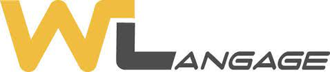

# WLangage
Introduction to the WLangage (beginners)

Hi everyone :)

I started in october 2023 my internship in a company who use the WLangage. This Repo is for people like me who don't know this language and want to discover and learn the basics.

I you have any questions / suggestions tell me !

FYI : English isn't my mother tongue ;)

Enjoy !
